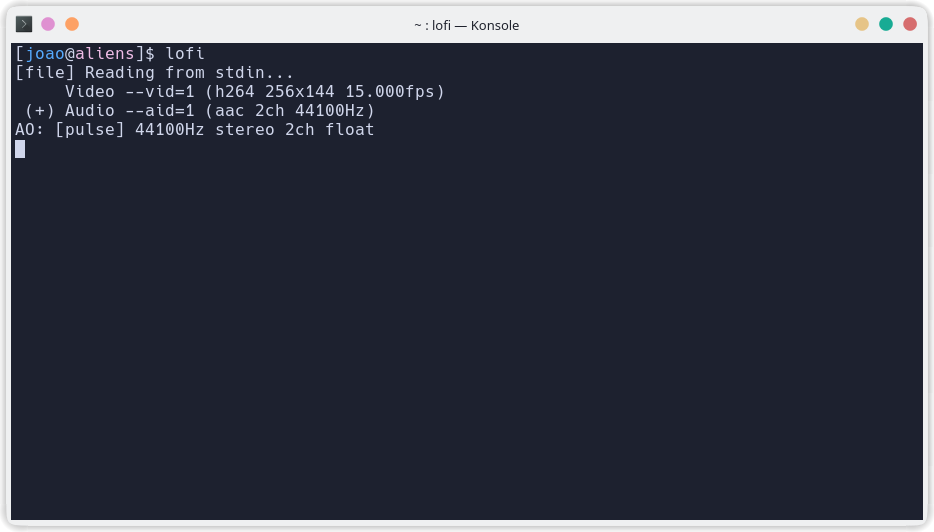
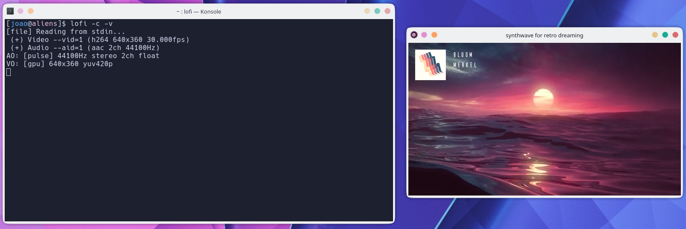

# lofi
Listen to "lofi hip hop - beats to relax / study to" or "ChillSynth FM" through the terminal (now with a math rock playlist too!)

## Dependencies:
+ yt-dlp
+ mpv

Both are very popular and should probably be on your distro's repositories.

## Usage:
```
$ lofi
      defaults to audio from lofi hip hop radio - beats to relax/study to
      -c for ChillSynth FM - lofi synthwave radio for retro dreaming
      -a for audio only
      -v for video
      -v [quality] sets the video quality
      Use yt-dlp -F <video_url> for quality list
      --help displays this message
```





## Credits:

This script only **streams** the music provided by [Lofi Girl](https://www.youtube.com/@LofiGirl), [Nightride FM](https://www.youtube.com/@NightrideFM) and [Gavin](https://www.youtube.com/@whyarethesefeelingsfleeting). I only made the script. Proper credits to the authors are given in their respective radios/playlists. Please do check their pages and support them if you can!
